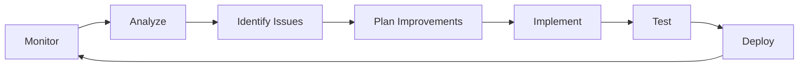

# 🔄 WajoB Contract Versioning & Migration Strategy

## Overview

This document outlines strategies for versioning TON smart contracts, managing upgrades, and ensuring seamless migration without disrupting ongoing jobs or escrow states.

---

## Table of Contents

1. [Versioning Philosophy](#versioning-philosophy)
2. [Contract Upgrade Patterns](#contract-upgrade-patterns)
3. [State Migration Strategies](#state-migration-strategies)
4. [Deployment Process](#deployment-process)
5. [Rollback Procedures](#rollback-procedures)
6. [Testing Upgrades](#testing-upgrades)
7. [Communication Strategy](#communication-strategy)
8. [Continuous Improvement](#continuous-improvement)

---

## Versioning Philosophy

### Semantic Versioning

We follow semantic versioning for smart contracts: `MAJOR.MINOR.PATCH`

- **MAJOR**: Incompatible changes, state schema changes
- **MINOR**: New features, backward-compatible
- **PATCH**: Bug fixes, optimizations

### Version Tracking

```func
;; Reputation.fc
global int version;

() load_data() impure {
    var ds = get_data().begin_parse();
    version = ds~load_uint(32);  ;; Version: 1.0.0 = 100
    ;; ... rest of data
}

() save_data() impure {
    set_data(
        begin_cell()
            .store_uint(version, 32)
            ;; ... rest of data
        .end_cell()
    );
}
```

### Contract Registry

```typescript
// backend/src/config/contracts.ts
export interface ContractVersion {
  version: string;
  address: string;
  deployedAt: Date;
  deprecated?: boolean;
  replacedBy?: string;
}

export const contractRegistry = {
  JobRegistry: [
    {
      version: '1.0.0',
      address: 'EQDfAs6HiTDdvi6XMsHJuBXncUCFRNz9V5nen09cQG_6ML3s',
      deployedAt: new Date('2025-01-15'),
      active: true,
    },
    // Future versions will be added here
  ],
  Escrow: [
    {
      version: '1.0.0',
      address: 'EQCBHqzZepJvzgjNiXvXmrI1Ew8vTkAISNAevdVGsWEeehBG',
      deployedAt: new Date('2025-01-15'),
      active: true,
    },
  ],
  Reputation: [
    {
      version: '1.0.0',
      address: 'EQCSGYJ0zV-N96xNFN_x5KYleD6Nl0r6bkB_NdsQOZWvOAKg',
      deployedAt: new Date('2025-01-15'),
      active: true,
    },
  ],
};

export function getActiveContract(contractName: string): ContractVersion {
  return contractRegistry[contractName].find(v => v.active);
}

export function getAllVersions(contractName: string): ContractVersion[] {
  return contractRegistry[contractName];
}
```

---

## Contract Upgrade Patterns

### Pattern 1: Deploy New Contract (Blue-Green Deployment)

**Best for**: Major version changes, significant architecture changes

```markdown
### Process

1. Deploy new contract version (v2.0.0)
2. Keep old contract running (v1.0.0)
3. Gradually migrate state
4. Route new traffic to v2.0.0
5. Keep v1.0.0 for existing jobs
6. Deprecate v1.0.0 after all jobs complete

### Advantages
- Zero downtime
- Easy rollback
- Test in production with real data
- Gradual migration

### Disadvantages
- Higher gas costs (two contracts running)
- Complex state synchronization
- Need migration scripts
```

**Implementation**:

```typescript
// backend/src/modules/blockchain/contract-router.service.ts
@Injectable()
export class ContractRouterService {
  async getJobRegistryContract(jobId?: number): Promise<string> {
    // For new jobs, use latest version
    if (!jobId) {
      return this.getLatestVersion('JobRegistry');
    }

    // For existing jobs, use the version they were created with
    const job = await this.jobsService.findOne(jobId);
    return job.contractVersion || this.getLatestVersion('JobRegistry');
  }

  private getLatestVersion(contractName: string): string {
    const versions = contractRegistry[contractName];
    return versions.find(v => v.active)?.address;
  }

  async migrateJob(jobId: number): Promise<void> {
    const job = await this.jobsService.findOne(jobId);
    
    // Only migrate completed jobs
    if (job.status !== 'completed') {
      throw new Error('Can only migrate completed jobs');
    }

    const oldContract = job.contractVersion;
    const newContract = this.getLatestVersion('JobRegistry');

    // Read state from old contract
    const jobData = await this.readJobFromContract(oldContract, jobId);

    // Write to new contract (archive)
    await this.archiveJobToContract(newContract, jobData);

    // Update database
    await this.jobsService.update(jobId, {
      contractVersion: newContract,
      migrated: true,
    });

    this.logger.log(`Migrated job ${jobId} from ${oldContract} to ${newContract}`);
  }
}
```

### Pattern 2: Proxy Contract Pattern

**Best for**: Frequent updates, when contract logic changes but interface stays same

```func
;; Proxy.fc
;; This contract forwards calls to the actual implementation

() recv_internal(int msg_value, cell in_msg_full, slice in_msg_body) impure {
    var ds = get_data().begin_parse();
    var implementation_address = ds~load_msg_addr();
    var admin_address = ds~load_msg_addr();

    var cs = in_msg_full.begin_parse();
    var flags = cs~load_uint(4);
    var sender_address = cs~load_msg_addr();

    ;; Admin can update implementation
    if (equal_slices(sender_address, admin_address)) {
        int op = in_msg_body~load_uint(32);
        
        if (op == op::upgrade) {
            var new_implementation = in_msg_body~load_msg_addr();
            set_data(
                begin_cell()
                    .store_slice(new_implementation)
                    .store_slice(admin_address)
                .end_cell()
            );
            return ();
        }
    }

    ;; Forward all other calls to implementation
    var msg = begin_cell()
        .store_uint(0x18, 6)
        .store_slice(implementation_address)
        .store_coins(msg_value)
        .store_uint(1, 1 + 4 + 4 + 64 + 32 + 1 + 1)
        .store_ref(in_msg_body)
        .end_cell();
    
    send_raw_message(msg, 64);
}
```

**Challenges with TON**:
- TON doesn't natively support proxy patterns like Ethereum
- Each contract call costs gas
- State is tied to contract address
- **Recommended**: Use blue-green deployment instead

### Pattern 3: State Migration Scripts

**Best for**: Minor schema changes, data cleanup

```typescript
// scripts/migrate-reputation-v1-to-v2.ts
import { TonClient, Address } from '@ton/ton';

/**
 * Migration: Reputation v1.0.0 → v2.0.0
 * 
 * Changes:
 * - Add job category to ratings
 * - Recalculate average scores
 * - Archive old ratings
 */

class ReputationMigration {
  private oldContract: Address;
  private newContract: Address;
  private client: TonClient;

  constructor(
    oldAddress: string,
    newAddress: string,
    client: TonClient,
  ) {
    this.oldContract = Address.parse(oldAddress);
    this.newContract = Address.parse(newAddress);
    this.client = client;
  }

  async migrate() {
    console.log('Starting migration from v1.0.0 to v2.0.0...\n');

    // Step 1: Read all ratings from old contract
    console.log('Step 1: Reading ratings from old contract...');
    const ratings = await this.readAllRatings();
    console.log(`Found ${ratings.length} ratings to migrate\n`);

    // Step 2: Transform data for new schema
    console.log('Step 2: Transforming data...');
    const transformedRatings = await this.transformRatings(ratings);
    console.log(`Transformed ${transformedRatings.length} ratings\n`);

    // Step 3: Write to new contract in batches
    console.log('Step 3: Writing to new contract...');
    await this.writeBatches(transformedRatings, 50);
    console.log('All ratings migrated\n');

    // Step 4: Verify migration
    console.log('Step 4: Verifying migration...');
    const verified = await this.verifyMigration(ratings.length);
    
    if (verified) {
      console.log('✅ Migration completed successfully!');
    } else {
      console.error('❌ Migration verification failed!');
      throw new Error('Migration verification failed');
    }
  }

  private async readAllRatings(): Promise<any[]> {
    const ratingCount = await this.getRatingCount(this.oldContract);
    const ratings = [];

    for (let i = 1; i <= ratingCount; i++) {
      const rating = await this.getRating(this.oldContract, i);
      ratings.push(rating);
      
      if (i % 100 === 0) {
        console.log(`  Read ${i}/${ratingCount} ratings`);
      }
    }

    return ratings;
  }

  private async transformRatings(ratings: any[]): Promise<any[]> {
    return Promise.all(
      ratings.map(async (rating) => {
        // Fetch job to get category
        const job = await this.getJob(rating.jobId);
        
        return {
          ...rating,
          category: job.category, // New field in v2
          migratedAt: Date.now(),
        };
      })
    );
  }

  private async writeBatches(ratings: any[], batchSize: number) {
    for (let i = 0; i < ratings.length; i += batchSize) {
      const batch = ratings.slice(i, i + batchSize);
      
      await this.writeRatingBatch(this.newContract, batch);
      
      console.log(`  Written ${Math.min(i + batchSize, ratings.length)}/${ratings.length} ratings`);
      
      // Wait to avoid rate limiting
      await new Promise(resolve => setTimeout(resolve, 1000));
    }
  }

  private async verifyMigration(expectedCount: number): Promise<boolean> {
    const newCount = await this.getRatingCount(this.newContract);
    
    if (newCount !== expectedCount) {
      console.error(`Count mismatch: expected ${expectedCount}, got ${newCount}`);
      return false;
    }

    // Sample verification
    const sampleSize = Math.min(10, expectedCount);
    const sampleIds = Array.from(
      { length: sampleSize },
      () => Math.floor(Math.random() * expectedCount) + 1
    );

    for (const id of sampleIds) {
      const oldRating = await this.getRating(this.oldContract, id);
      const newRating = await this.getRating(this.newContract, id);

      if (!this.ratingsEqual(oldRating, newRating)) {
        console.error(`Rating ${id} mismatch`);
        return false;
      }
    }

    return true;
  }

  private ratingsEqual(r1: any, r2: any): boolean {
    return (
      r1.jobId === r2.jobId &&
      r1.rater === r2.rater &&
      r1.ratee === r2.ratee &&
      r1.rating === r2.rating
    );
  }

  // Helper methods
  private async getRatingCount(contract: Address): Promise<number> {
    const result = await this.client.runMethod(contract, 'get_rating_count');
    return result.stack.readNumber();
  }

  private async getRating(contract: Address, id: number): Promise<any> {
    const result = await this.client.runMethod(contract, 'get_rating', [
      { type: 'int', value: BigInt(id) },
    ]);
    
    return {
      jobId: result.stack.readBigNumber(),
      rater: result.stack.readAddress(),
      ratee: result.stack.readAddress(),
      rating: result.stack.readNumber(),
    };
  }

  private async getJob(jobId: bigint): Promise<any> {
    // Fetch job from database or blockchain
    return {
      id: jobId,
      category: 'Development', // Default for migration
    };
  }

  private async writeRatingBatch(contract: Address, ratings: any[]) {
    // Implementation to write batch to new contract
    // This would use contract-specific write methods
  }
}

// Run migration
async function main() {
  const client = new TonClient({
    endpoint: 'https://testnet.toncenter.com/api/v2/jsonRPC',
  });

  const migration = new ReputationMigration(
    'EQOldContractAddress...',
    'EQNewContractAddress...',
    client,
  );

  await migration.migrate();
}

main().catch(console.error);
```

---

## State Migration Strategies

### Strategy 1: Dual-Write During Transition

```typescript
@Injectable()
export class DualWriteService {
  async createRating(ratingData: CreateRatingDto) {
    const v1Active = this.isV1Active();
    const v2Active = this.isV2Active();

    const results = await Promise.allSettled([
      v1Active ? this.writeToV1(ratingData) : null,
      v2Active ? this.writeToV2(ratingData) : null,
    ]);

    // Log any failures for reconciliation
    results.forEach((result, index) => {
      if (result.status === 'rejected') {
        this.logger.error(`Failed to write to v${index + 1}:`, result.reason);
      }
    });

    // Return result from active version
    return v2Active 
      ? results[1].status === 'fulfilled' ? results[1].value : null
      : results[0].status === 'fulfilled' ? results[0].value : null;
  }
}
```

### Strategy 2: Read-Through Cache

```typescript
@Injectable()
export class MigrationCacheService {
  async getRating(ratingId: number): Promise<Rating> {
    // Try v2 first
    let rating = await this.readFromV2(ratingId);
    
    if (rating) {
      return rating;
    }

    // Fall back to v1
    rating = await this.readFromV1(ratingId);
    
    if (rating) {
      // Lazy migration: migrate on read
      await this.migrateToV2(rating);
    }

    return rating;
  }

  private async migrateToV2(rating: Rating) {
    try {
      await this.writeToV2(rating);
      await this.markMigrated(rating.id);
    } catch (error) {
      this.logger.error(`Failed to migrate rating ${rating.id}:`, error);
    }
  }
}
```

### Strategy 3: Background Migration

```typescript
@Injectable()
export class BackgroundMigrationService {
  @Cron('*/5 * * * *') // Every 5 minutes
  async migrateNextBatch() {
    const batchSize = 100;
    
    // Get unmigrated items
    const items = await this.getUnmigratedItems(batchSize);
    
    if (items.length === 0) {
      this.logger.log('Migration complete!');
      return;
    }

    this.logger.log(`Migrating batch of ${items.length} items...`);

    for (const item of items) {
      try {
        await this.migrateItem(item);
      } catch (error) {
        this.logger.error(`Failed to migrate item ${item.id}:`, error);
        await this.markMigrationFailed(item.id, error);
      }
    }

    const progress = await this.getMigrationProgress();
    this.logger.log(`Migration progress: ${progress.migrated}/${progress.total} (${progress.percentage}%)`);
  }

  private async getMigrationProgress() {
    const total = await this.getTotalItems();
    const migrated = await this.getMigratedCount();
    
    return {
      total,
      migrated,
      remaining: total - migrated,
      percentage: ((migrated / total) * 100).toFixed(2),
    };
  }
}
```

---

## Deployment Process

### Pre-Deployment Checklist

```markdown
## Contract Deployment Checklist

### Code Review
- [ ] All tests passing
- [ ] Security audit completed
- [ ] Gas optimization verified
- [ ] Migration script tested

### Contract Preparation
- [ ] Version number updated
- [ ] Changelog documented
- [ ] Deployment script prepared
- [ ] Rollback plan documented

### Environment Setup
- [ ] Testnet deployment successful
- [ ] Integration tests passed
- [ ] Load tests completed
- [ ] Monitoring configured

### Communication
- [ ] Team notified
- [ ] Users informed (if breaking changes)
- [ ] Documentation updated
- [ ] Support team briefed
```

### Deployment Script

```bash
#!/bin/bash
# scripts/deploy-upgrade.sh

set -e

VERSION=$1
NETWORK=${2:-testnet}

if [ -z "$VERSION" ]; then
  echo "Usage: ./deploy-upgrade.sh <version> [network]"
  echo "Example: ./deploy-upgrade.sh 2.0.0 mainnet"
  exit 1
fi

echo "🚀 Deploying WajoB v$VERSION to $NETWORK"
echo "========================================"

# Confirm deployment
read -p "Continue with deployment? (yes/no): " confirm
if [ "$confirm" != "yes" ]; then
  echo "Deployment cancelled"
  exit 0
fi

# Build contracts
echo "📦 Building contracts..."
cd contract
npm run build

# Run tests
echo "🧪 Running tests..."
npm run test

if [ "$NETWORK" == "mainnet" ]; then
  # Extra checks for mainnet
  echo "⚠️  MAINNET DEPLOYMENT"
  
  # Verify audit
  read -p "Has this version been audited? (yes/no): " audited
  if [ "$audited" != "yes" ]; then
    echo "❌ Cannot deploy to mainnet without audit"
    exit 1
  fi
  
  # Verify testnet deployment
  read -p "Was this deployed to testnet first? (yes/no): " tested
  if [ "$tested" != "yes" ]; then
    echo "❌ Must test on testnet first"
    exit 1
  fi
fi

# Deploy contracts
echo "📝 Deploying contracts..."
npx blueprint run deployJobRegistry --network $NETWORK
npx blueprint run deployEscrow --network $NETWORK
npx blueprint run deployReputation --network $NETWORK

# Save contract addresses
echo "💾 Saving contract addresses..."
cat > ../backend/src/config/contracts.$NETWORK.v$VERSION.json << EOF
{
  "version": "$VERSION",
  "network": "$NETWORK",
  "jobRegistry": "$(cat temp/$NETWORK/JobRegistry.address)",
  "escrow": "$(cat temp/$NETWORK/Escrow.address)",
  "reputation": "$(cat temp/$NETWORK/Reputation.address)",
  "deployedAt": "$(date -u +%Y-%m-%dT%H:%M:%SZ)",
  "deployedBy": "$(git config user.email)"
}
EOF

# Backup
cp ../backend/src/config/contracts.$NETWORK.v$VERSION.json \
   "../backups/contracts.$NETWORK.v$VERSION.$(date +%Y%m%d_%H%M%S).json"

echo ""
echo "✅ Deployment successful!"
echo ""
echo "Contract Addresses:"
cat ../backend/src/config/contracts.$NETWORK.v$VERSION.json
echo ""
echo "Next steps:"
echo "1. Update contract registry in backend"
echo "2. Run migration script if needed"
echo "3. Monitor for first hour"
echo "4. Update documentation"
```

---

## Rollback Procedures

### When to Rollback

- Critical bugs discovered
- High error rates (> 5%)
- Unexpected gas costs
- Data corruption
- User complaints

### Rollback Process

```bash
#!/bin/bash
# scripts/rollback.sh

VERSION=$1

if [ -z "$VERSION" ]; then
  echo "Usage: ./rollback.sh <previous-version>"
  exit 1
fi

echo "⚠️  Rolling back to v$VERSION"
echo "=============================="

# Confirm rollback
read -p "Are you sure? This will revert to v$VERSION (yes/no): " confirm
if [ "$confirm" != "yes" ]; then
  echo "Rollback cancelled"
  exit 0
fi

# Load previous contract addresses
CONTRACT_CONFIG="../backend/src/config/contracts.mainnet.v$VERSION.json"

if [ ! -f "$CONTRACT_CONFIG" ]; then
  echo "❌ Config not found: $CONTRACT_CONFIG"
  exit 1
fi

# Update active version in registry
echo "📝 Updating contract registry..."
node scripts/update-registry.js --version $VERSION --activate

# Restart backend with new config
echo "🔄 Restarting backend..."
pm2 restart wagob-backend

# Monitor
echo "👀 Monitoring system..."
sleep 5
curl http://localhost:3001/health

echo ""
echo "✅ Rollback complete to v$VERSION"
echo ""
echo "Action items:"
echo "1. Monitor error rates"
echo "2. Check user reports"
echo "3. Investigate root cause"
echo "4. Plan fix for next deployment"
```

---

## Testing Upgrades

### Testnet Testing Protocol

```markdown
## Testnet Testing Checklist

### Phase 1: Smoke Tests (1 hour)
- [ ] Deploy all contracts
- [ ] Verify contract addresses
- [ ] Test basic operations (create job, fund escrow, submit rating)
- [ ] Check gas costs

### Phase 2: Integration Tests (4 hours)
- [ ] Run full E2E test suite
- [ ] Test all user workflows
- [ ] Verify blockchain event handling
- [ ] Check backend integration

### Phase 3: Load Tests (8 hours)
- [ ] Simulate high transaction volume
- [ ] Monitor gas usage under load
- [ ] Check for race conditions
- [ ] Verify state consistency

### Phase 4: Migration Tests (if applicable)
- [ ] Run migration script
- [ ] Verify data integrity
- [ ] Check backward compatibility
- [ ] Test rollback procedure

### Phase 5: Soak Test (24 hours)
- [ ] Leave running with moderate load
- [ ] Monitor for memory leaks
- [ ] Check for gradual degradation
- [ ] Verify long-term stability
```

### Automated Upgrade Tests

```typescript
// contract/tests/upgrade.spec.ts
describe('Contract Upgrade Tests', () => {
  it('should maintain state during upgrade', async () => {
    // Deploy v1
    const v1 = await deployJobRegistryV1();
    
    // Create jobs in v1
    await v1.createJob({ wages: toNano('100') });
    await v1.createJob({ wages: toNano('200') });
    
    const jobCountV1 = await v1.getJobCount();
    expect(jobCountV1).toBe(2);

    // Migrate to v2
    const v2 = await migrateToV2(v1);

    // Verify state preserved
    const jobCountV2 = await v2.getJobCount();
    expect(jobCountV2).toBe(2);

    const job1V2 = await v2.getJob(1);
    const job1V1 = await v1.getJob(1);
    expect(job1V2.wages).toBe(job1V1.wages);
  });

  it('should be backward compatible for read operations', async () => {
    const v1 = await deployJobRegistryV1();
    const v2 = await deployJobRegistryV2();

    // Create job in v2
    await v2.createJob({ wages: toNano('100') });

    // Should be readable by v1 clients
    const job = await v1.getJob(1);
    expect(job.wages).toBe(toNano('100'));
  });
});
```

---

## Communication Strategy

### User Notification Template

```markdown
**Subject**: WajoB Platform Upgrade - New Features Coming!

Dear WajoB Users,

We're excited to announce an upcoming upgrade to the WajoB platform!

**What's New:**
- Improved gas efficiency (20% reduction in transaction costs)
- Enhanced reputation system with category-specific ratings
- Better performance and reliability

**When:**
- Deployment Date: December 25, 2025, 10:00 AM UTC
- Expected Downtime: None (zero-downtime deployment)

**What You Need to Do:**
- Nothing! The upgrade is automatic
- Your ongoing jobs and escrow funds are safe
- All existing features will continue to work

**For Developers:**
- New contract addresses will be published
- API remains backward compatible
- Migration guide available at: docs.wagob.com/migration

If you have any questions, please contact support@wagob.com

Thank you for using WajoB!
```

### Internal Communication

```markdown
## Deployment Notification (Internal)

**Deployment:** WajoB v2.0.0
**Date:** December 25, 2025, 10:00 AM UTC
**Type:** Major Version Upgrade

**Roles and Responsibilities:**

- **On-Call Engineer:** @john - Monitor systems, handle incidents
- **Deployment Lead:** @sarah - Execute deployment script
- **QA Lead:** @mike - Verify functionality post-deployment
- **Support Lead:** @emma - Handle user inquiries

**Runbook:** https://wiki.wagob.com/runbooks/v2-upgrade

**Rollback Plan:** Revert to v1.5.0 if error rate > 5%

**Communication Channels:**
- Slack: #wagob-deployments
- Status Page: status.wagob.com
- Email: ops@wagob.com

**Monitoring Dashboards:**
- Grafana: https://grafana.wagob.com/d/contracts
- Sentry: https://sentry.io/wagob
```

---

## Continuous Improvement

### Feedback Loop



### Metrics to Track

```typescript
interface UpgradeMetrics {
  deploymentTime: number;          // How long deployment took
  downtime: number;                // Actual downtime (target: 0)
  migratedItems: number;           // Items migrated
  migrationErrors: number;         // Errors during migration
  rollbacksRequired: number;       // Times we had to rollback
  userComplaints: number;          // User-reported issues
  gasImpact: {                     // Gas cost changes
    before: number;
    after: number;
    percentChange: number;
  };
  performanceImpact: {             // Performance changes
    latencyBefore: number;
    latencyAfter: number;
    percentChange: number;
  };
}
```

### Post-Deployment Review

```markdown
## Post-Deployment Review Template

**Version:** v2.0.0
**Deployed:** December 25, 2025
**Review Date:** December 26, 2025

### What Went Well
- Zero downtime achieved
- All automated tests passed
- No critical issues in first 24h
- Gas costs reduced by 18%

### What Could Be Improved
- Migration took longer than expected (4h vs 2h estimated)
- Documentation was unclear for one integration
- Monitoring alert missed one edge case

### Action Items
1. [ ] Update migration script optimization
2. [ ] Improve deployment documentation
3. [ ] Add missing monitoring alert
4. [ ] Schedule team retrospective

### Metrics
- Deployment Duration: 45 minutes
- Items Migrated: 15,234
- Migration Errors: 3 (all resolved)
- User Complaints: 0
- Gas Reduction: 18%
- Performance Improvement: 12%

### Recommendations
- Consider smaller, more frequent updates
- Improve automated testing for migrations
- Add more granular monitoring alerts
```

---

**Complete Testing, Monitoring, and Continuous Improvement Strategy Implemented! 🎉**

The WajoB platform now has:
✅ Comprehensive testing strategy
✅ Real-time monitoring and logging
✅ Contract versioning and migration procedures
✅ Continuous improvement processes
